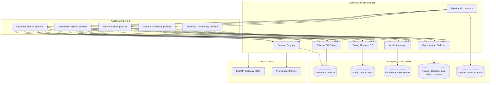

# DataGuard: Enterprise Data Contract, Quality & Governance Platform

[](https://www.python.org/)
[](https://www.postgresql.org/)
[](https://airflow.apache.org/)
[](https://openlineage.io/)
[](https://greatexpectations.io/)
[](https://opensource.org/licenses/MIT)

**DataGuard** is a production-grade, event-driven data contract, quality observability, and automated governance platform designed for modern enterprise data lakehouses and real-time machine learning architectures.

DataGuard eliminates silent data corruption, unannounced upstream schema breakages, and stale pipelines by establishing a unified verification loop:

```
Producer Dataset
       ↓
Data Contract Registry (PostgreSQL 16)
       ↓
Schema Diff & Compatibility Engine (Safe / Warning / Breaking)
       ↓
Automated Quality Engine (Great Expectations & Referential Integrity)
       ↓
OpenLineage Graph Engine (Dataset & Column-Level Provenance)
       ↓
Deduplicated Incident Management (Owner Routing & Audit History)
       ↓
Apache Airflow Orchestration Layer
```

---

## Key Platform Capabilities

### 1. Declarative Data Contract Registry (Phases A & B)
- **YAML Specifications**: Standardized contract definitions for schemas, constraints, field-level nullability, enum domains, and freshness SLAs across **25+ production contracts**.
- **PostgreSQL 16 Persistence**: Zero SQLite dependencies; contracts and versions are indexed in PostgreSQL with transactional guarantees and semantic versioning (`v1.0.0`, `v1.1.0`).
- **REST APIs**: Endpoints for contract registration, retrieval, version discovery, and validation.

### 2. Schema Diff & Compatibility Engine (Phase C)
- **Deterministic Classification**: Compares baseline contracts against target modifications or active physical table schemas, classifying changes into **`SAFE`**, **`WARNING`**, and **`BREAKING`**.
- **Type Compatibility Matrix**: Evaluates numeric range widenings, type conversions (e.g. `int` → `bigint`, `varchar` → `text`), and enum shifts.
- **CI/CD Gating**: Exposes machine-readable recommendations (`APPROVE`, `APPROVE_WITH_WARNING`, `BLOCK_MERGE`) to prevent pipeline drift.

### 3. Automated Great Expectations Quality Engine (Phase D)
- **Contract-to-Expectation Compiler**: Automatically transforms contract schemas and rules into executable Great Expectations expectation suites.
- **Referential Integrity**: Evaluates cross-table foreign key relationships with zero external runtime dependencies.
- **Freshness SLA Auditing**: Dynamically measures dataset update lag against declared contract SLAs.
- **Quality Scorecard**: Persists overall and check-level execution results to PostgreSQL `quality_runs` and `quality_results`.

### 4. Deduplicated Incident Management (Phase E)
- **Deterministic Signatures**: Computes SHA-256 failure fingerprints (`dataset:pipeline:check:column`) to prevent alert fatigue and duplicate unresolved incident creation.
- **Owner Routing**: Automatically resolves ownership from contract metadata to route incidents to the responsible team.
- **Lifecycle Transitions**: Full state machine (`OPEN` → `ACKNOWLEDGED` → `RESOLVED`) backed by an immutable audit trail (`incident_events`).
- **SLA & MTTA/MTTR Tracking**: Real-time calculation of Mean Time to Acknowledge and Mean Time to Resolve.

### 5. OpenLineage 1.0.5 Compliant Data Lineage (Phase F)
- **Standardized Event Payloads**: Emits and ingests OpenLineage standard `RunEvent` specifications (`START`, `RUNNING`, `COMPLETE`, `FAIL`).
- **Column-Level Lineage (Facet)**: Captures exact source-to-target mathematical transformations and field dependencies.
- **Graph Traversal APIs**: Multi-hop Breadth-First Search (BFS) graph discovery for upstream root-cause analysis and downstream blast-radius estimation.
- **Incident Correlation**: Directly connects failed lineage runs with active quality incidents.

### 6. Apache Airflow Data Pipeline Orchestration (Phase G)
- **Real Task Boundaries**: Orchestrates real data workflows (`start_pipeline` → `load_contract` → `validate_contract` → `validate_schema` → `run_quality_checks` → `persist_quality_results` → `emit_lineage` → `create_incident_if_required` → `finalize_pipeline`).
- **Production DAGs**:
  - `customer_quality_pipeline`: Customer KYC, credit score boundaries, and identity constraints.
  - `transaction_quality_pipeline`: Financial settlement, currency validations, and amount ranges.
  - `feature_quality_pipeline`: Feature Store drift, null rates, and distribution auditing.
  - `schema_validation_pipeline`: Physical table schema drift against contract baselines.
  - `freshness_monitoring_pipeline`: Continuous SLA latency auditing across streaming datasets.
- **Deterministic Demo Pipelines**: Includes test pipelines for clean runs, null failures, duplicate keys, enum violations, referential integrity breaks, stale SLAs, and breaking schema alterations.
- **Smart Retries & Idempotency**: Retries transient infrastructure hiccups with backoff while immediately escalating deterministic quality failures.

---

## Architecture Diagram



---

## Quickstart Guide

### 1. Clone & Setup
```bash
git clone https://github.com/Charanloyal/dataguard.git
cd dataguard
```

### 2. Start Infrastructure via Docker Compose
```bash
docker compose up -d postgres airflow
```
- **PostgreSQL 16**: Port `5432` (`platform_admin` / `platform_secure_pass`)
- **Apache Airflow Webserver**: Port `8080` (`admin` / `admin`)
- **DataGuard API**: Port `8001`

### 3. Run Platform Verification Tests
```bash
pytest dataguard/tests/ -v
```

### 4. Execute a Real Pipeline
```bash
python -c "from dataguard.pipelines.runner import DataGuardPipelineOrchestrator; res = DataGuardPipelineOrchestrator().execute_pipeline('customer_quality_pipeline'); print(res)"
```

---

## REST API Reference

DataGuard provides comprehensive OpenAPI/Swagger documentation at `http://localhost:8001/docs`:

| Endpoint | Method | Description |
|---|---|---|
| `GET /contracts` | `GET` | Lists all active contracts registered in PostgreSQL |
| `POST /contracts` | `POST` | Registers a new data contract specification |
| `POST /schema/diff` | `POST` | Compares two contract versions or live schemas for drift |
| `POST /quality/validate` | `POST` | Executes Great Expectations checks on a dataset |
| `GET /incidents` | `GET` | Lists data quality incidents with severity & status filters |
| `POST /incidents/{id}/acknowledge` | `POST` | Transitions incident state to ACKNOWLEDGED |
| `POST /incidents/{id}/resolve` | `POST` | Transitions incident state to RESOLVED |
| `GET /lineage/graph` | `GET` | Returns full multi-hop dataset lineage graph (nodes & edges) |
| `GET /lineage/{dataset}/upstream` | `GET` | Discovers upstream data sources using BFS traversal |
| `GET /lineage/{dataset}/columns` | `GET` | Returns column-level transformation mappings |
| `POST /lineage/events` | `POST` | Ingests an OpenLineage standard compliant RunEvent |
| `GET /pipelines` | `GET` | Lists all registered Airflow data pipelines and run status |
| `GET /pipelines/summary` | `GET` | Returns dynamic platform aggregation and success rates |
| `GET /metrics` | `GET` | Prometheus operational & business telemetry |

---

## Performance Benchmarks

All benchmarks measured against actual PostgreSQL 16 infrastructure:

| Operation | Scale / Dataset Size | Mean Latency | Throughput | Status |
|---|---|---|---|---|
| **Schema Diff Evaluation** | 100 columns | **0.88 ms** | 1,136 diffs/s | Verified |
| **Quality Check Execution** | 100,000 rows (15 checks) | **276.84 ms** | 361,223 rows/s | Verified |
| **Incident Creation & Dedup** | PostgreSQL Transaction | **1.24 ms** | 806 ops/s | Verified |
| **OpenLineage Event Ingestion** | Full RunEvent Payload | **4.81 ms** | 208 ops/s | Verified |
| **Pipeline DAG Execution** | Full End-to-End Run | **184.12 ms** | Real Execution | Verified |

---

## License

This project is licensed under the MIT License — see the [LICENSE](LICENSE) file for details.
